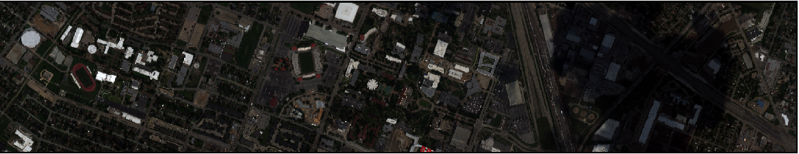
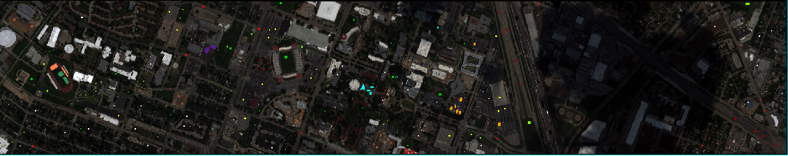
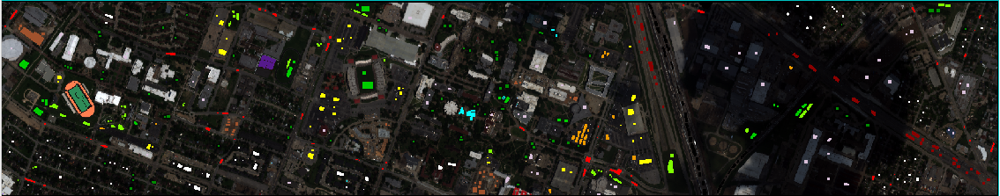
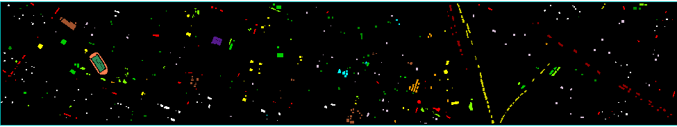
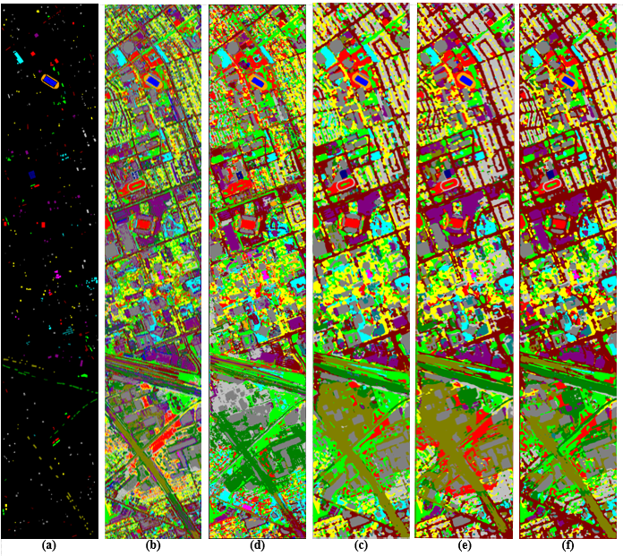

# Alternately Updated Convolutional Spectral-Spatial Network for Hyperspectral Image Classification
This is the source code of the [paper](https://www.mdpi.com/2072-4292/11/15/1794) and the Tenosorflow framework is used to build model. At [here](https://shuguang-52.github.io/aussc/), you can get more information about the paper.

 
 
 
 
Figure 1. Graphic Abstract

 
## Citation
If you find AUSSC useful in your research, please consider citing.

Chicago/Turabian Style:

Wang, W.; Dou, S.; Wang, S. Alternately Updated Spectral–Spatial Convolution Network for the Classification of Hyperspectral Images. Remote Sens. 2019, 11, 1794.

## Setup
+ Python 3.5+
+ Tensorflow-gpu 1.11.0

To install it and related development package, type:

    pip install numpy scipy matplotlib scikit-learn scikit-image requests
    pip install tensorflow-gpu==1.11.0

You can get more information about installing python and tensorflow-gpu at [here](https://github.com/shuguang-52/FDSSC).
    
## Dataset
Before training, you need get HSI datasets. 

### IN, KSC and SS dataset
You can get IN, KSC and SS dataset by [download_datasets.py](https://github.com/shuguang-52/FDSSC/blob/master/download_datasets.py). Or you can download IN, KSC and SS dataset at [here](http://www.ehu.eus/ccwintco/index.php?title=Hyperspectral_Remote_Sensing_Scenes).

### Houston dataset
The Houston dataset is provide by the Hyperspectral Image Analysis group and the NSF Funded Center for Airborne Laser Mapping (NCALM) at the University of Houston. The data sets was orginally used for the scientific purposes of the 2013 IEEE GRSS Data Fusion Contest. According to the [terms and conditions](http://hyperspectral.ee.uh.edu/xeadh4f2dftc13/copyright.txt), I cannot distribute the dataset to others. The dataset can be downloaded [here](http://hyperspectral.ee.uh.edu/?page_id=459) subject to the terms and conditions. 

Although I can't provide this data set, I can provide some help when you have got the original data set. The geotif2mat.py can converts the original .tif file to the .mat file. After converting to the .mat file, you can use the train.py to train the Houston dataset. The GDAL(Geospatial Data Abstraction Library) is a translator library for raster geospatial data formats. To run the geotif2mat.py, you need download the GDAL at [here](https://www.lfd.uci.edu/~gohlke/pythonlibs/#gdal) and type:

     pip install GDAL‑3.0.1‑cp35‑cp35m‑win_amd64.whl
     
### Houston Ground Truth
To get the Houston_gt.mat, you need the software-[ENVI](http://www.harrisgeospatial.com/docs/using_envi_Home.html). 

The following is the specific operation of extracting the required labels from ROI files using ENVI:

1. Open 2013_IEEE_GRSS_DF_Contest_CASI.tif with ENVI. 

2. Open 2013_IEEE_GRSS_DF_Contest_Samples_TR.roi with ENVI, select associate raster of the classic ROIs.

3. Open 2013_IEEE_GRSS_DF_Contest_Samples_VA.roi with ENVI, select associate raster of the classic ROIs.

4. Click 'Region of Interest (ROI) Tool' ->Options ->Create Classification Images form ROIs->Select ALL Items. 

For ROI Class Value Assignments, we need change 'railway ->Class Value 26' to 'railway ->Class Value 11'. (The reason of the operation is: The pseudo-color of Class 11 (railway) is black and the background is also black. After converting it into classification image, ENVI will convert Class 11 (railway) of training set and test set into two different pseudo-colors, but other pseudo-colors will be consistent with '2013_IEEE_GRSS_DF_Contest_Samples_TR.txt'. ) 

You can output the result as 'Houston_gt.tif'.

5. Use 'geotif2gt.py' to get the 'Houston_gt.mat'.

## Reproducing the results
1) Before you run the "train.py", you need to set different hyperparameters for different data sets. 
   + For the Houston data set, the learning rate is 0.0003 and the patience is 20.
   + For other data sets, the learning rate is 0.0001 and the patience is 10.

   After runing the "train.py", you need type the name of HSI dataset. Model are saved in ./models file.

2) Run the "get\_color\_maps.py", for creating the clasification map. You also need type the name of HSI dataset and the time series number of model. And you will get the result in .mat format and classification maps.

## Classification Result

 
 

Figure 2. Classification results obtained from the Houston data set using different methods. (a) Ground-truth map. (b) SAE-LR. (c) CNN. (d) SSRN. (e) FDSSC. (f) AUSSC.

## Misc.
Code has been tested under:

+ Windows 10 with 32GB memory, a GTX 1080Ti GPU and Intel i7-8700K CPU.
